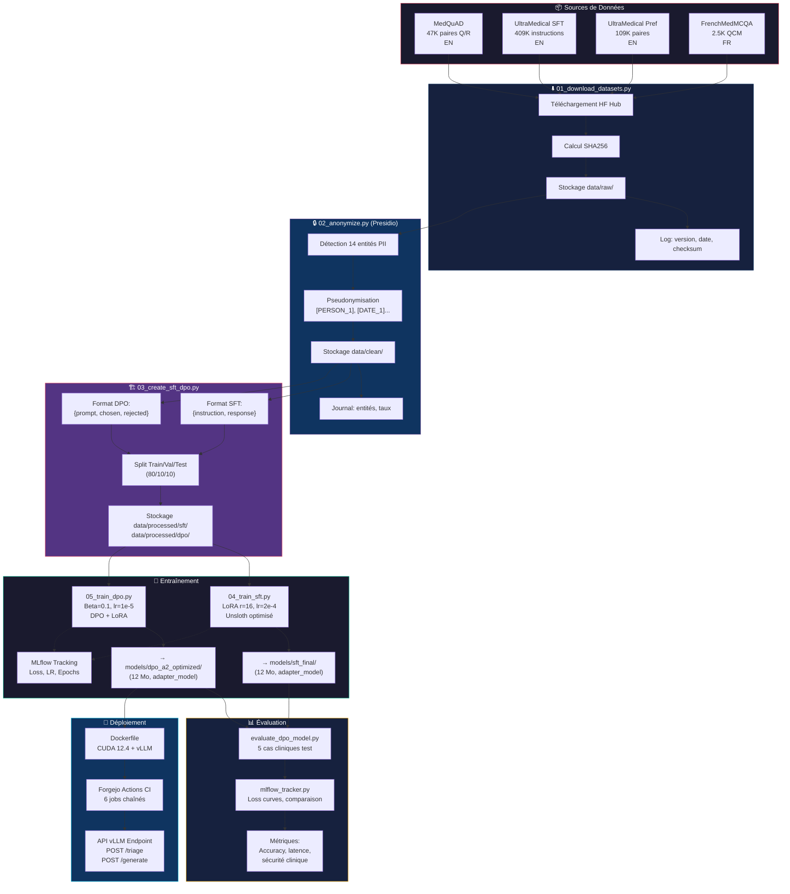

# Schéma du Flux de Données — PosoLogic

> Diagramme du pipeline complet de traitement des données
> Du dataset source à l'API de triage

---

## Diagramme Global



---

## Flux Détaillé — Traçabilité

```
[Source]              [Script]              [Sortie]              [Métadonnées]
─────────────────────────────────────────────────────────────────────────────────
HuggingFace Hub   →    01_download    →    data/raw/          [version,

date, SHA256]
                                                              ↓
data/raw/         →    02_anonymize   →    data/clean/        [entités Presidio, %anonymisé]
                                                              ↓
data/clean/       →    03_create_sft  →    data/processed/    [splits, distribution priorités]
                                                              ↓
data/processed/   →    04_train_sft   →    models/sft_final/  [config LoRA, loss, epochs]
data/processed/   →    05_train_dpo   →    models/dpo_final/  [config DPO, beta, loss]
                                                              ↓
models/dpo_final/ →    Dockerfile     →    Image Docker        [CUDA 12.4, vLLM, Presidio]
                                                              ↓
Image Docker      →    CI (Forgejo)   →    API Endpoint        [healthcheck, /triage]
```

---

## Structure des Données à Chaque Étape

### Étape 1 — Raw
```
data/raw/
├── medquad/
│   └── data.arrow          (47K paires Q/R)
├── ultramedical/
│   ├── sft/
│   │   └── data.arrow      (409K instructions)
│   └── preference/
│       └── data.arrow      (109K paires)
├── frenchmedmcqa/
│   └── data.arrow          (2.5K QCM)
└── datasets_checksums.json
```

### Étape 2 — Clean (anonymisé)
```
data/clean/
├── medquad_anon.arrow
├── ultramedical_sft_anon.arrow
├── ultramedical_pref_anon.arrow
├── frenchmedmcqa_anon.arrow
└── anonymization_report.json
```

### Étape 3 — Processed (formaté)
```
data/processed/
├── sft/
│   ├── train/    (365 800 exemples)
│   ├── val/      (45 700 exemples)
│   └── test/     (45 700 exemples)
├── dpo/
│   ├── train/    (87 400 exemples)
│   ├── val/      (10 900 exemples)
│   └── test/     (10 900 exemples)
└── splits_report.json
```

### Étape 4 — Modèles
```
models/
├── sft_config.json
├── dpo_config.json
├── checkpoints/
│   ├── sft_final/
│   │   ├── adapter_model.safetensors   (12 Mo)
│   │   ├── adapter_config.json
│   │   └── tokenizer/
│   └── dpo_a2_optimized/
│       ├── final/
│       │   ├── adapter_model.safetensors   (12 Mo)
│       │   ├── adapter_config.json
│       │   └── tokenizer/
│       └── checkpoint-*/               (15 checkpoints)
└── mlruns/                             (MLflow tracking)
```

---

## Métadonnées de Traçabilité

Chaque script enregistre ses métadonnées pour garantir la reproductibilité :

| Script | Fichier de log | Contenu |
|--------|---------------|---------|
| `01_download` | `datasets_checksums.json` | version, date, SHA256 par dataset |
| `02_anonymize` | `anonymization_report.json` | entités, compteurs, taux |
| `03_create_sft_dpo` | `splits_report.json` | distribution, tailles, niveaux de priorité |
| `04_train_sft` | `sft_training_log.json` | hyperparamètres, loss par step |
| `05_train_dpo` | `dpo_training_log.json` | hyperparamètres, loss par step |
| `mlflow_tracker` | `mlruns/` | tout : params, metrics, artifacts |

---

**Schéma conforme à l'exigence mentorat : traçabilité complète de la source au déploiement.**
 date, SHA256]
                                                              ↓
data/raw/         →    02_anonymize   →    data/clean/        [entités Presidio, %anonymisé]
                                                              ↓
data/clean/       →    03_create_sft  →    data/processed/    [splits, distribution priorités]
                                                              ↓
data/processed/   →    04_train_sft   →    models/sft_final/  [config LoRA, loss, epochs]
data/processed/   →    05_train_dpo   →    models/dpo_final/  [config DPO, beta, loss]
                                                              ↓
models/dpo_final/ →    Dockerfile     →    Image Docker        [CUDA 12.4, vLLM, Presidio]
                                                              ↓
Image Docker      →    CI (Forgejo)   →    API Endpoint        [healthcheck, /triage]
```

---

## Structure des Données à Chaque Étape

### Étape 1 — Raw
```
data/raw/
├── medquad/
│   └── data.arrow          (47K paires Q/R)
├── ultramedical/
│   ├── sft/
│   │   └── data.arrow      (409K instructions)
│   └── preference/
│       └── data.arrow      (109K paires)
├── frenchmedmcqa/
│   └── data.arrow          (2.5K QCM)
└── datasets_checksums.json
```

### Étape 2 — Clean (anonymisé)
```
data/clean/
├── medquad_anon.arrow
├── ultramedical_sft_anon.arrow
├── ultramedical_pref_anon.arrow
├── frenchmedmcqa_anon.arrow
└── anonymization_report.json
```

### Étape 3 — Processed (formaté)
```
data/processed/
├── sft/
│   ├── train/    (365 800 exemples)
│   ├── val/      (45 700 exemples)
│   └── test/     (45 700 exemples)
├── dpo/
│   ├── train/    (87 400 exemples)
│   ├── val/      (10 900 exemples)
│   └── test/     (10 900 exemples)
└── splits_report.json
```

### Étape 4 — Modèles
```
models/
├── sft_config.json
├── dpo_config.json
├── checkpoints/
│   ├── sft_final/
│   │   ├── adapter_model.safetensors   (12 Mo)
│   │   ├── adapter_config.json
│   │   └── tokenizer/
│   └── dpo_a2_optimized/
│       ├── final/
│       │   ├── adapter_model.safetensors   (12 Mo)
│       │   ├── adapter_config.json
│       │   └── tokenizer/
│       └── checkpoint-*/               (15 checkpoints)
└── mlruns/                             (MLflow tracking)
```

---

## Métadonnées de Traçabilité

Chaque script enregistre ses métadonnées pour garantir la reproductibilité :

| Script | Fichier de log | Contenu |
|--------|---------------|---------|
| `01_download` | `datasets_checksums.json` | version, date, SHA256 par dataset |
| `02_anonymize` | `anonymization_report.json` | entités, compteurs, taux |
| `03_create_sft_dpo` | `splits_report.json` | distribution, tailles, niveaux de priorité |
| `04_train_sft` | `sft_training_log.json` | hyperparamètres, loss par step |
| `05_train_dpo` | `dpo_training_log.json` | hyperparamètres, loss par step |
| `mlflow_tracker` | `mlruns/` | tout : params, metrics, artifacts |

---

**Schéma conforme à l'exigence mentorat : traçabilité complète de la source au déploiement.**
